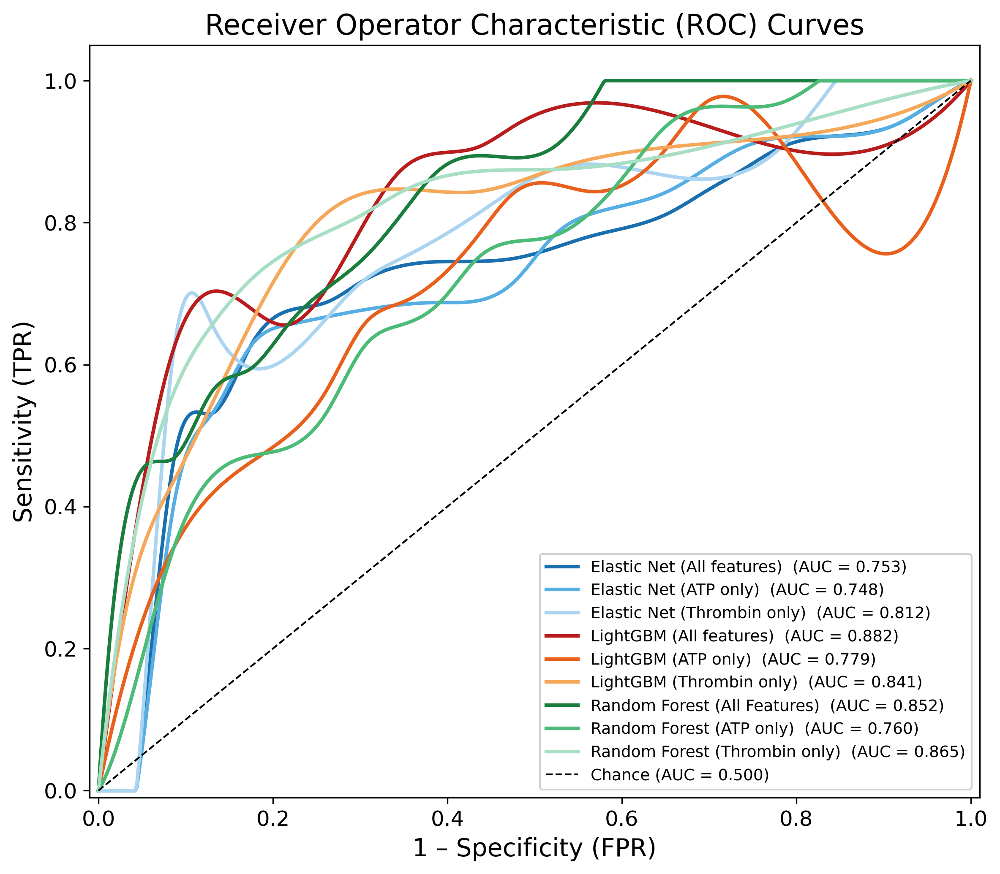

# Machine learning based analysis of Bleeding Disorder of Unknown Cause patients

## Methodology

To identify features predictive of BDUC case-control status, we evaluated the performance of three supervised learning models in classifying BDUC patients vs controls. Random forest, which combines the outputs of a large collection of uncorrelated decision trees to improve predictive performance was used. The Boruta algorithm, which iteratively compares each feature’s importance against random probes and only retains those that consistently outperform the chance threshold, was used to identify optimal features for random forest classification. We subsequently employed elastic net logistic regression, a classification method that employs both lasso and ridge penalties, allowing it to effectively handle multicollinearity. This model performs inherent feature selection, with lasso regularisation removing features with a coefficient of zero. Lastly, we employed a Light Gradient Boosting Machine (LightGBM) model, a gradient boosting model that builds trees sequentially to correct prior errors, as opposed to random forest which builds them independently and aggregates their results. LightGBM feature selection was conducted using SHAP (Shapley Additive exPlanations) values across the 5-fold stratified cross-validation. Within each fold, features were ranked by mean absolute SHAP importance and were only retained if they were in the 50th percentile of importance in 3/5 folds. This model commonly exhibits higher performance than random forest and elastic net logistic regression, at the cost of an increased tendency of overfitting.

Within each model, we employed a nested cross-validation framework using stratified 5-fold cross validated grid search for hyperparameter optimisation. Using the optimal hyperparameter combination, the model was then evaluated using a second stratified 5-fold cross validation, with the optimal classification threshold determined by Youden’s J statistic. After the initial model revealed selected thrombin and ATP-release based assays as the most important features, subsequent models were run using only these features to assess their classification performance and mechanistic importance in BDUC patients.

